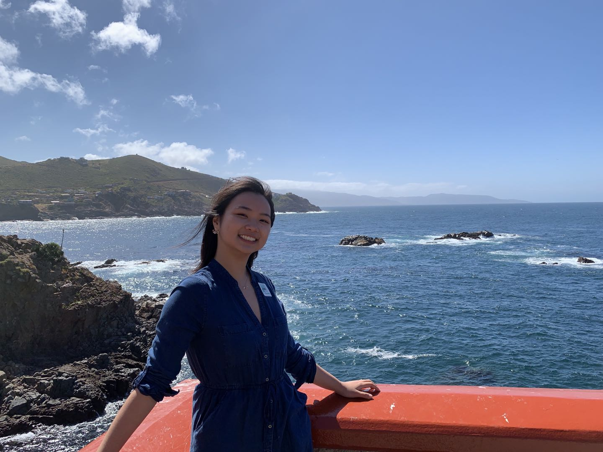

# Welcome to Emma Yuan's User Page

## About Me
Hey I'm Emma, a second-year MathCS major in Warren! I'm proficient in Java, Python, and Swift and if you're interested in developing iOS apps together, please DM me :D\
\


## My Favs 

**Quote**
> Hakuna matata!

**Line of Code**
```
print("Hello World!")
```

**Links**
- [the readme file](README.md)
- [what's recursion?](https://www.google.com/search?q=recursion&oq=recursion&aqs=chrome..69i57j0i20i263i433j0i131i433j46i433j0i131i433l3j0l2j0i131i433.3320j1j1&sourceid=chrome&ie=UTF-8)
- [what're my favs again?](#my-favorites)

## Two Truths and a Lie
- [x] dog person
- [x] aot fan
- [ ] love autocaps
